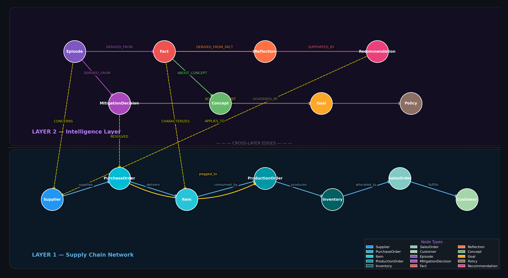

# The Decision Intelligence Layer for Agentic Supply Chain

## Why Context Graphs Matter in Supply Chain

Modern supply chains are instrumented with vast ERP data — purchase orders, inventory positions, production schedules, supplier records — but AI agents operating on this data face a fundamental limitation: they reason in isolation. Each disruption event is evaluated from scratch, with no memory of how similar situations were handled, which vendors have chronic reliability issues, or which mitigations actually held up under pressure. The result is reactive, inconsistent decision-making that fails to compound organizational learning over time.

A **context graph** addresses this directly. Rather than treating every disruption as a novel problem, it maintains a structured, queryable record of past decisions, outcomes, and synthesized patterns — anchored to the same supply chain entities the agent acts upon. The agent enters each situation pre-loaded with relevant institutional knowledge, not just live ERP state.

---

## Two-Layer Architecture

The graph is organized into two co-existing layers connected by cross-layer edges.

**Layer 1 — Supply Chain Network** is the live operational fabric sourced from ERP (e.g., Dynamics 365). It captures the entities and relationships that define how supply moves through the organization:

| Node Types | Edge Types |
|---|---|
| Supplier, Item, PurchaseOrder, ProductionOrder, Inventory, SalesOrder, Customer | `supplies`, `delivers`, `consumed_by`, `produces`, `allocated_to`, `fulfills`, `pegged_to`, `alternate_for` |

**Layer 2 — Intelligence Layer** accumulates institutional memory across agent runs. It is populated and updated automatically each time the agent handles a disruption:

| Node Types | Edge Types |
|---|---|
| Episode, MitigationDecision, Fact, Reflection, Concept, Goal, Policy, Recommendation | `NEXT`, `DERIVED_FROM`, `DERIVED_FROM_FACT`, `HAS_CONCEPT`, `ABOUT_CONCEPT`, `GOVERNED_BY`, `SCORED_AGAINST`, `SUPPORTED_BY` |

Cross-layer edges — `CONCERNS`, `CHARACTERIZES`, `RESOLVED`, `TARGETS`, `APPLIES_TO` — anchor every memory construct to the specific supply chain entity it pertains to, keeping context traceable and auditable.

---

## Graph Traversal in Practice

When a disruption arrives — a 14-day delay from Vendor 1003 on a DC Motor component pegged to a Tier 1 retail sales order — the agent traverses both layers simultaneously rather than consulting Layer 1 alone.

Starting from Vendor 1003 in Layer 1, the agent follows `CHARACTERIZES` edges upward into Layer 2, reaching six historical Episodes involving the same vendor. From these Episodes, distilled **Fact** nodes surface a repeating pattern: Vendor 1003 delays on this component class more than three times per year, and safety stock erosion is a documented downstream consequence. A **Reflection** synthesized from these Facts identifies an alternate supplier — Vendor 1002 — with a strong prior fulfillment record, captured in earlier MitigationDecision outcomes.

The agent scores candidate mitigations against active **Goal** nodes (SLA attainment, cost) and **Policy** nodes (procurement approval thresholds). The top-ranked recommendation — issue a replacement purchase order to Vendor 1002 — arrives with a documented rationale grounded in organizational history, not just current inventory math.

Upon execution, a new Episode and MitigationDecision are written back to Layer 2. The intelligence layer compounds with every run: the next disruption on the same vendor or component class arrives with richer context, higher-confidence recommendations, and a shorter path to resolution.
